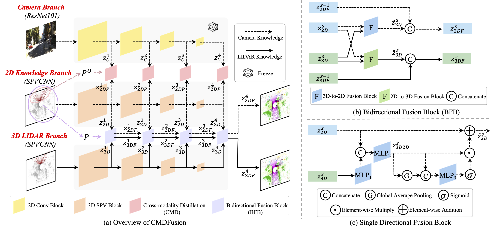

# CMDFusion

This repository is for **CMDFusion** introduced in the following [paper](https://arxiv.org/abs/2307.04091)
"CMDFusion: Bidirectional Fusion Network with Cross-modality Knowledge Distillation for LIDAR Semantic Segmentation",
[Jun CEN](www.cen-jun.com), Shiwei Zhang, Yixuan Pei, Kun Li, Hang Zheng, Maochun Luo, Yingya Zhang, [Qifeng Chen](https://cqf.io/)



## Installation

### Requirements
- pytorch >= 1.8 
- yaml
- easydict
- pyquaternion
- [lightning](https://github.com/Lightning-AI/lightning) (tested with pytorch_lightning==1.3.8 and torchmetrics==0.5)
- [torch-scatter](https://github.com/rusty1s/pytorch_scatter) (pip install torch-scatter -f https://data.pyg.org/whl/torch-1.9.0+${CUDA}.html)
- [nuScenes-devkit](https://github.com/nutonomy/nuscenes-devkit) (optional for nuScenes)
- [spconv](https://github.com/traveller59/spconv) (tested with spconv==2.1.16 and cuda==11.1, pip install spconv-cu111==2.1.16)

## Data Preparation

### SemanticKITTI
Please download the files from the [SemanticKITTI website](http://semantic-kitti.org/dataset.html) and additionally the [color data](http://www.cvlibs.net/download.php?file=data_odometry_color.zip) from the [Kitti Odometry website](http://www.cvlibs.net/datasets/kitti/eval_odometry.php). Extract everything into the same folder.
```
./dataset/
├── 
├── ...
└── SemanticKitti/
    ├──sequences
        ├── 00/           
        │   ├── velodyne/	
        |   |	├── 000000.bin
        |   |	├── 000001.bin
        |   |	└── ...
        │   └── labels/ 
        |   |   ├── 000000.label
        |   |   ├── 000001.label
        |   |   └── ...
        |   └── image_2/ 
        |   |   ├── 000000.png
        |   |   ├── 000001.png
        |   |   └── ...
        |   calib.txt
        ├── 08/ # for validation
        ├── 11/ # 11-21 for testing
        └── 21/
	    └── ...
```

### NuScenes
Please download the Full dataset (v1.0) from the [NuScenes website](https://www.nuscenes.org/) with lidarseg and extract it.
```
./dataset/
├── 
├── ...
└── nuscenes/
    ├──v1.0-trainval
    ├──v1.0-test
    ├──samples
    ├──sweeps
    ├──maps
    ├──lidarseg
```

## Training
### SemanticKITTI
You can run the training with
```shell script
cd <root dir of this repo>
python main.py --log_dir CMDFusion_semkitti --config config/CMDFusion-semantickitti-g.yaml --gpu 0 1
```
The output will be written to `logs/SemanticKITTI/CMDFusion_semkitti` by default. 
### SemanticKITTI with PolarMix
After training the model on the SemanticKITTI dataset, we use additional instance-level augmentation from [PolarMix](https://github.com/xiaoaoran/polarmi) to finetune the model for better performance. Note that followeing [2DPASS](https://github.com/yanx27/2DPASS), the validation set is also included in the training set during finetuning.
```shell script
cd <root dir of this repo>
python main.py --log_dir CMDFusion_semkitti_ft --config config/CMDFusion-semantickitti-g-all-ft.yaml --gpu 0 1 --checkpoint /path_to_trained_checkpoint --fine_tune
```
### SemanticKITTI-O
Uncomment Line 180 and comment Line 181 in `network/arch_cmd_fusion.py`. Open Line 171 in `network/base_model_distil.py`. Then run the training with
```shell script
cd <root dir of this repo>
python main.py --log_dir CMDFusion_semkitti_o --config config/CMDFusion-semantickitti-g.yaml --gpu 0 1
```
### NuScenes
Uncomment Line 180 and comment Line 181 in `network/arch_cmd_fusion.py`. Then run the training with
```shell script
cd <root dir of this repo>
python main.py --log_dir CMDFusion_nusc --config config/CMDFusion-nuscenese-g-L.yaml --gpu 0 1
```
We use two A100 (80G) GPUs and train for 4 days.
## Validation
You can run the validation with
```shell script
cd <root dir of this repo>
python main.py --config config/CMDFusion-semantickitti-g.yaml --gpu 0 --test --checkpoint <dir for the pytorch checkpoint>
```
Note that for SemanticKITTI-O, open Line 171 in `network/base_model_distil.py`.

## Testing
You can run the testing with
```shell script
cd <root dir of this repo>
python main.py --config config/CMDFusion-semantickitti-g.yaml --gpu 0 --test --num_vote 12 --checkpoint <dir for the pytorch checkpoint> --submit_to_server
```
Here, `num_vote` is the number of views for the test-time-augmentation (TTA). We set this value to 12 as default following [2DPASS](https://github.com/yanx27/2DPASS). 
## Model Zoo
You can download the models with the scores below from [this Google drive folder](https://drive.google.com/drive/folders/1bVfLr13mS_4rMiDKNrjMj6t9he6CZX9N?usp=sharing).
|Model (validation)|Val (mIoU)|Test (mIoU)|
|:---:|:---:|:---:|
|CMDFusion-SemanticKITTI-O|67.6%|-|
|CMDFusion-SemanticKITTI|66.2%|68.6%|
|CMDFusion-SemanticKITTI-polarmix|86.4%|71.6%|
|CMDFusion-NuScenes|77.3%|80.8%|

## Acknowledgements
Code is built based on [2DPASS](https://github.com/yanx27/2DPASS), [SPVNAS](https://github.com/mit-han-lab/spvnas), [Cylinder3D](https://github.com/xinge008/Cylinder3D), [xMUDA](https://github.com/valeoai/xmuda) and [SPCONV](https://github.com/traveller59/spconv).

## License
See [Apache-2.0 License](/LICENSE).


